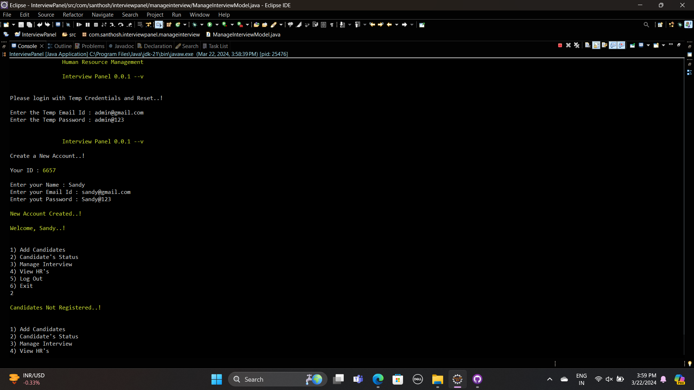
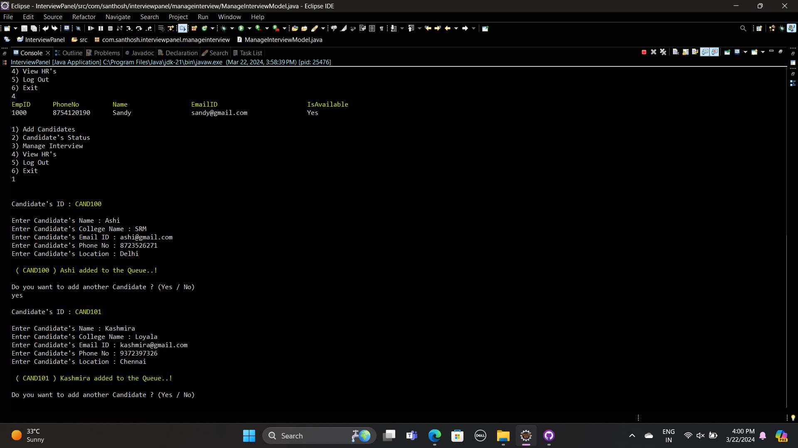
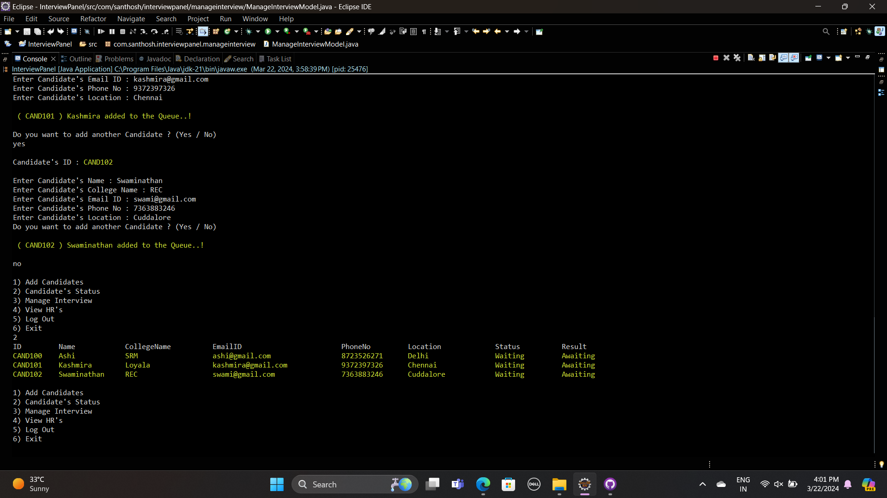
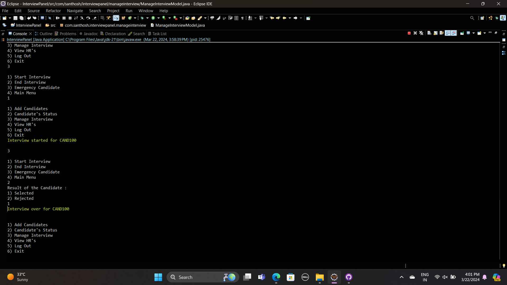
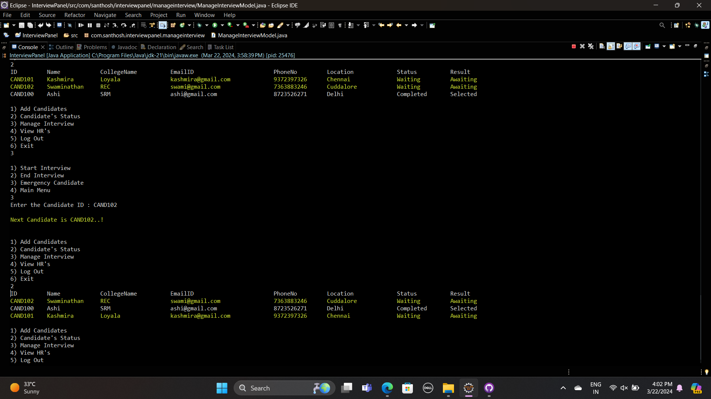
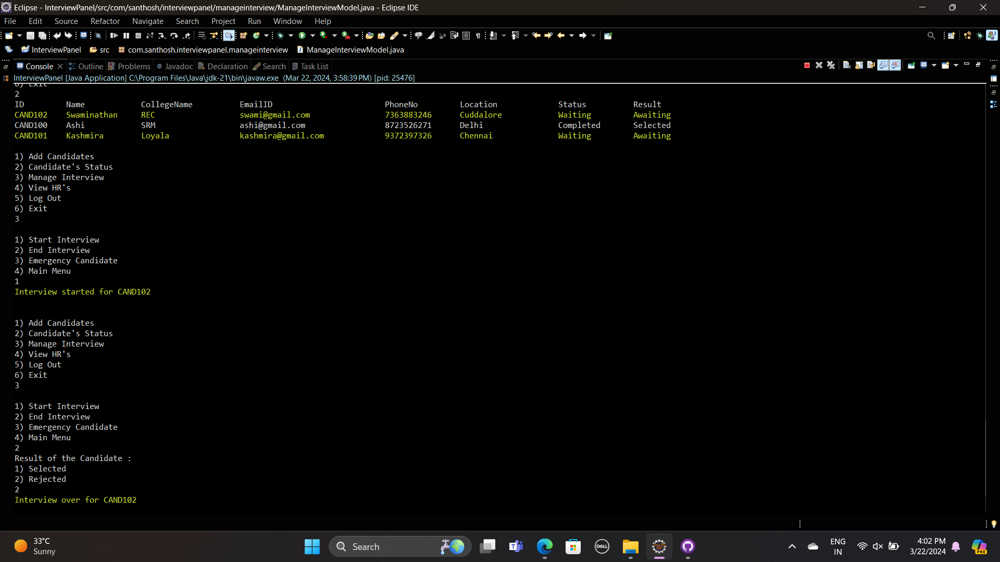
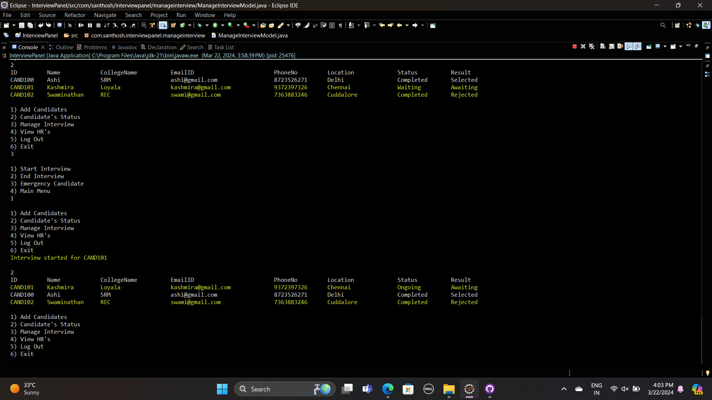
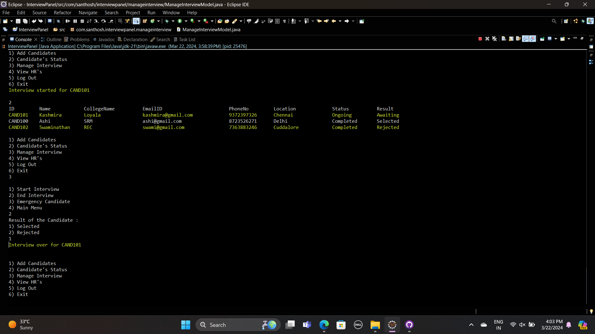
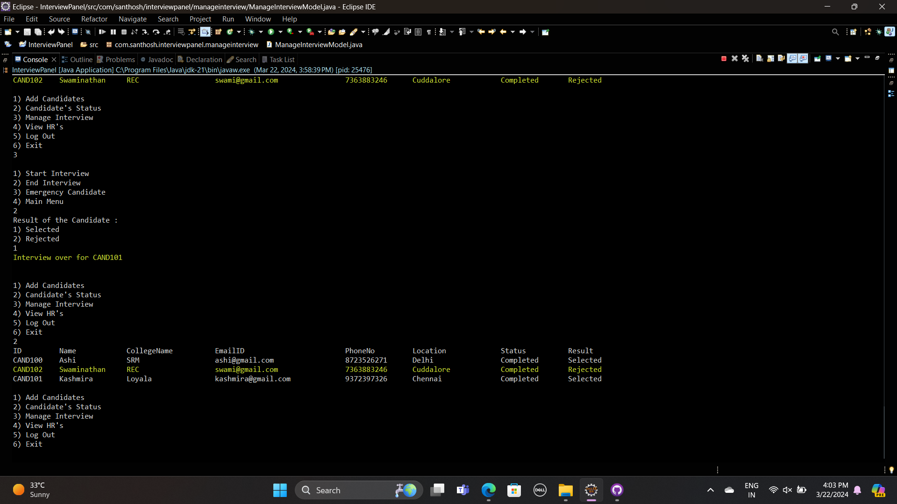
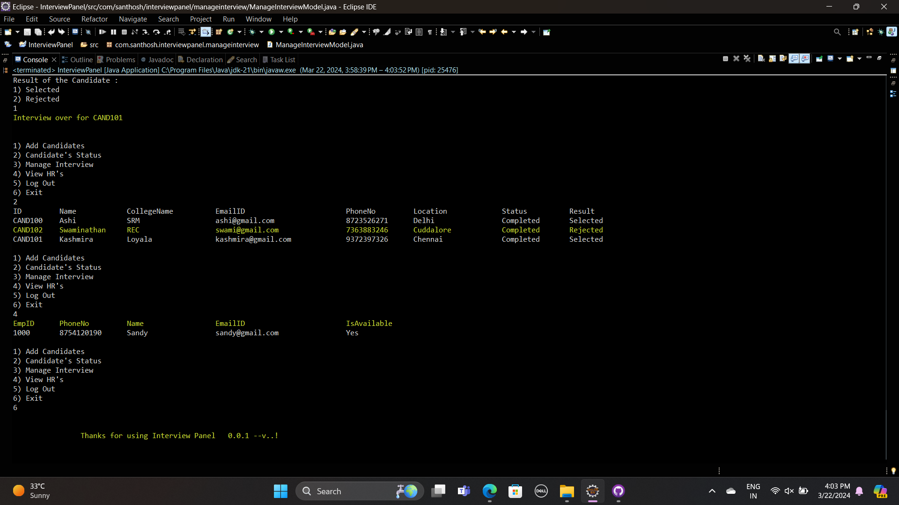

# *Interview Panel Application*

Welcome to the Interview Panel Application! This application is designed to streamline the interview process by providing features for managing candidates, scheduling interviews, and managing HR personnel.


## Screenshots

**Console Interface**





















## Features

- **User Authentication:** Secure login system for first time setup with temporary credentials.
- **Candidate Management:** Add and view candidate details, including their status in the interview process.
- **Interview Scheduling:** Schedule and manage interviews with candidates.
- **HR Management:** View HR personnel, including their availability.

## Developed Using

**IDE :** Eclipse

**Language :** Java 


## To Run the Project

*Clone the project*

```bash
  git clone https://github.com/santhoshswamyv/ConsoleApplications.git
```

*Go to the project directory*

```bash
  cd InterviewPanel
  cd src/com/santhosh/interviewpanel
```
*Open the Project in any IDE*

```bash
  run the InterviewPanel.java
```


## 🔗 Links & Support

[](https://www.linkedin.com/in/santhosh-swamy-v-22ab6b234)

[](https://instagram.com/sd._.sandy?igshid=MzRlODBiNWFlZA==)

[](https://wa.me/+918754120190)
